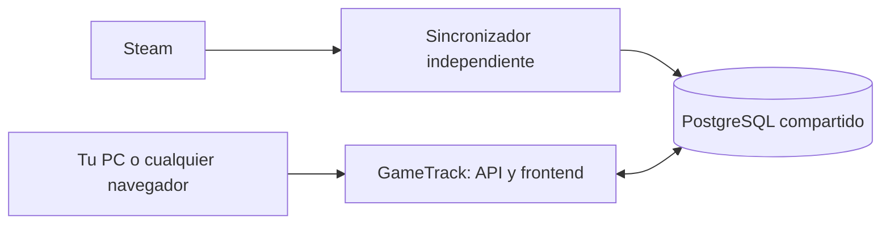

# Catálogo de Steam fuera de esta PC

La API y el sincronizador pueden ejecutarse por separado y compartir PostgreSQL.
El sincronizador obtiene novedades de Steam y completa fichas; la API sirve los
datos guardados. El navegador no descarga el catálogo de Steam.



El repositorio incluye la configuración para un servidor Linux con Docker
Compose. **Los archivos de despliegue no crean ni contratan un servidor.** Para
que funcione con esta PC apagada, esos contenedores deben ejecutarse en otra
máquina que permanezca encendida. Se puede usar un VPS, una máquina del equipo
o servicios administrados con procesos persistentes y PostgreSQL.

## Componentes

| Servicio | Función |
|---|---|
| `db` | PostgreSQL 17, con volumen persistente y sin puerto público. |
| `migrate` | Aplica Alembic antes de iniciar los demás servicios. |
| `api` | FastAPI y frontend; consulta la base, sin sincronizador embebido. |
| `catalog-worker` | Proceso independiente que importa índice y fichas. |

API y worker usan la misma imagen. La clave de Steam sólo se inyecta en el
worker en este despliegue; el navegador y la API no la necesitan para consultar
el catálogo. Las funciones opcionales de biblioteca/perfil de Steam que usen
la Web API seguirán necesitando configurar esa integración en la API.

## Preparar el servidor

Comandos desde la raíz del proyecto, en un servidor Linux con Docker Compose:

```bash
cp deploy/.env.example deploy/.env
```

Completar `POSTGRES_PASSWORD`, `SECRET_KEY` y `STEAM_API_KEY` en ese archivo.
Generar valores distintos para los dos primeros, por ejemplo con
`python3 -c "import secrets; print(secrets.token_hex(32))"`. Usar hexadecimal
para la contraseña de PostgreSQL, porque Compose la incorpora en una URL.
`deploy/.env` está ignorado por Git y excluido de la imagen.

Para empezar con una base nueva:

```bash
docker compose --env-file deploy/.env up -d --build
docker compose --env-file deploy/.env ps
curl --fail http://127.0.0.1:8000/healthz
curl --fail http://127.0.0.1:8000/api/v1/steam/catalog/status
```

El índice se importa por páginas y las fichas gradualmente. Una base nueva no
contiene usuarios ni valoraciones de la demo. Para conservar la base actual,
seguir la sección de copia **antes** de iniciar API y worker.

Por defecto, la API escucha en el loopback del servidor. Para probarla desde
otra PC, usar un túnel: `ssh -L 8001:127.0.0.1:8000 usuario@servidor` y abrir
`http://localhost:8001`. Para compartir una dirección pública, configurar un
dominio y un proxy HTTPS hacia `127.0.0.1:8000`. PostgreSQL no necesita exponerse.

## Conservar la base SQLite actual

La herramienta `backend/scripts/copy_sqlite_to_postgres.py` copia tablas por
lotes, preservando IDs, relaciones, cola y checkpoint. Abre SQLite en modo
sólo lectura y exige un PostgreSQL vacío cuyo esquema ya esté migrado. El modo
predeterminado sólo valida y muestra recuentos; `--execute` realiza la copia.
Si falla, revierte la transacción del destino. No reemplaza bases con datos.
La validación también detecta textos históricos que SQLite aceptaba por encima
de los límites de PostgreSQL: informa tabla y columna, sin recortarlos ni
publicar su contenido. Corregir esos casos en una copia revisada antes de migrar.

1. Detener el backend y el importador locales y obtener una copia consistente
   de SQLite mediante la API de backup de SQLite (no copiar sólo el archivo
   `.db` mientras se están escribiendo archivos WAL).
2. Guardar esa copia en `deploy/backups/origen.db` en el servidor, mediante el
   acceso privado que utilicen. Incluye datos de usuarios; no va en Git ni en
   la imagen de Docker.
3. Preparar sólo la base y las migraciones:

```bash
docker compose --env-file deploy/.env build
docker compose --env-file deploy/.env up -d db
docker compose --env-file deploy/.env run --rm migrate
```

4. Validar y luego copiar, con API y worker detenidos:

```bash
docker compose --env-file deploy/.env run --rm --no-deps \
  -v "$PWD/deploy/backups:/source:ro" api \
  python scripts/copy_sqlite_to_postgres.py --source /source/origen.db

docker compose --env-file deploy/.env run --rm --no-deps \
  -v "$PWD/deploy/backups:/source:ro" api \
  python scripts/copy_sqlite_to_postgres.py --source /source/origen.db --execute

docker compose --env-file deploy/.env up -d api catalog-worker
```

No se copian latidos de procesos anteriores. El artefacto de IA está asociado
a la base usada para entrenar: después de la copia, volver a entrenarlo contra
PostgreSQL, conservando la procedencia real del dataset:

```bash
docker compose --env-file deploy/.env exec api \
  python scripts/train_local_model.py --data-label demo
```

`demo` corresponde al dataset actual; no usarlo para rotular datos reales. El
artefacto se guarda en `model-data`, compartido y persistente. El recomendador
general sigue disponible aunque todavía no se haya entrenado ese artefacto.

## Otros alojamientos y desarrollo local

Para servicios administrados, usar la imagen o instalar
`backend/requirements-postgres.txt`. El prototipo usa `psycopg2-binary` para
evitar compilación durante el despliegue. Este paquete incluye sus bibliotecas
de PostgreSQL/TLS: sus actualizaciones requieren actualizar el paquete y
reconstruir la imagen, además del mantenimiento del servidor.

Configurar en ambos procesos la misma `DATABASE_URL`,
`STEAM_CATALOG_WORKER_MODE=external` y `DB_AUTO_CREATE=false`. La API además
necesita su `SECRET_KEY` estable; sólo el importador necesita `STEAM_API_KEY`
para el índice. Ejecutar desde `backend`:

```bash
python -m alembic upgrade head
# Servicio web:
python -m uvicorn app.main:app --host 0.0.0.0 --port 8000
# Servicio independiente:
python -m app.workers.steam_catalog
```

El worker requiere una conexión PostgreSQL directa o un pooler de **sesión**.
Un pooler por transacción no conserva el bloqueo de sesión que coordina las
importaciones. Cada worker mantiene una conexión adicional mientras procesa
una tanda; considerar ese uso al configurar el límite de conexiones.

Para seguir usando la demo local, no hace falta cambiar `.env`: los valores
predeterminados siguen siendo SQLite, `embedded` y creación automática de
tablas. Dos PCs con SQLite separados siguen teniendo catálogos separados.
Si una API local apunta a PostgreSQL compartido, debe usar `external`.

## Estado y mantenimiento

El estado de ejecución se persiste en PostgreSQL cada 15 segundos; tras 90
segundos sin actividad deja de mostrarse como activo. Una API puede informar
el estado del importador aunque éste corra en otra máquina. El cierre limpio
registra el proceso como detenido, y un reinicio conserva cola y checkpoints.

```bash
docker compose --env-file deploy/.env logs --tail=80 catalog-worker
docker compose --env-file deploy/.env restart catalog-worker
```

Los volúmenes conservan la base y modelos entre reinicios; `down -v` los elimina.
Mantener copias fuera del disco del servidor. Ejemplo de backup, en Linux:

```bash
mkdir -p deploy/backups
docker compose --env-file deploy/.env exec -T db \
  pg_dump -U gametrack -Fc gametrack > deploy/backups/gametrack.dump
```

Antes de actualizar el código, hacer backup, construir la imagen, detener API y
worker, aplicar `run --rm migrate` y volver a iniciar ambos. Las migraciones no
se ejecutan simultáneamente desde cada réplica web.

## Verificación del despliegue

Validado el 28/09/2026: imagen construida y stack Compose iniciado con una base
vacía de prueba, sin claves reales ni llamadas a Steam. La API respondió al
healthcheck, catálogo y frontend, y leyó la presencia del worker en otro
contenedor. Al detener la API el worker continuó publicando actividad; al detener
el worker, la API informó su cierre. Esto verifica la separación de procesos,
no constituye una instalación en un alojamiento externo.

Suite general: 422 pruebas aprobadas y 16 omitidas. Tras agregar la comprobación
de textos históricos, las 30 pruebas de transferencia pasaron. Las tres pruebas
optativas de PostgreSQL también pasaron contra PostgreSQL 17 real. Los 19 módulos
JavaScript pasaron la validación de sintaxis.

Las pruebas de PostgreSQL usan una base de prueba dedicada y crean un esquema
temporal para cada caso. No apuntarlas a la base del proyecto. Ejemplo desde
`backend`, con `GAMETRACK_TEST_POSTGRES_URL` configurada en el entorno y un nombre
de base que empiece por `gametrack_test`:

```bash
python -m pytest tests/test_postgres_integration.py -q
```

Comprueban las migraciones, la copia SQLite/PostgreSQL, secuencias, bloqueos entre
conexiones independientes y estado remoto sin clave en la API. Sin esa variable
se omiten; el resto de la suite utiliza bases temporales SQLite.

En redes con inspección TLS, el build permite montar un archivo PEM de CAs de
confianza sin incorporarlo a la imagen ni desactivar la validación de TLS:

```bash
docker build --secret id=build_ca,src=/ruta/ca-confiable.pem -t gametrack:local .
```

Esto sólo aplica a las descargas durante la construcción. Si esa misma red
inspecciona las llamadas del contenedor en ejecución, configurar también su
almacén de confianza. Un servidor fuera de esa red normalmente no lo necesita.

Referencias: [orden y salud de servicios en Docker Compose](https://docs.docker.com/compose/how-tos/startup-order/),
[instalación de Psycopg](https://www.psycopg.org/docs/install) y
[bloqueos de PostgreSQL](https://www.postgresql.org/docs/current/explicit-locking.html#ADVISORY-LOCKS).
